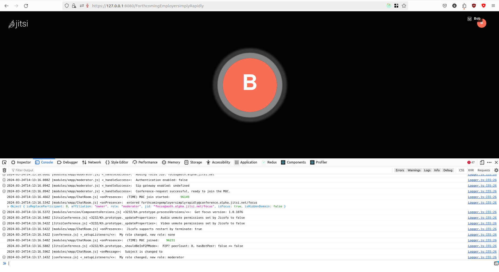

# SafeCall - Jitsi Integration 

This project is can be run only on Ubuntu. Make sure to follow these instructions on an Ubuntu machine with atleast 8GB RAM. 

The repositories that hold the application code are jitsi-meet and deepfake-api. 

Capstone-ai and grad-project-feature-extraction are repositories that assist with the creation of machine learning models and generating a dataset. 

**The following steps are to test the application code**

To test the Capstone-ai and grad-project-feature-extraction code, scroll past these first set of instructions. 

## Installation

### Step 1: clone this repository 
```
git clone https://github.com/Windsmith/321-Grad-Project-Submission.git
```

### Step 2: Open terminal in the cloned repository

In the terminal where you cloned the repository run
```
cd 321-Grad-Project-Submission
```

or you can cd into the same folder from anywhere

### Step 3: Run the install script

```
./install.sh
```

This script installs all the dependencies for the different sub repositories. It also installs the necessary python and nodejs versions. 

## Running the Application

### Step 1: Run the deepfake api in the terminal

```
cd deepfake-api
poetry run task deploy
```

This will run the deepfake api within the terminal. Make sure not to close the terminal. 

The api runs on http://127.0.0.1:8000


### Step 2: Run Jitsi Meet

Open another terminal and cd into project folder. Then run

```
cd jitsi-meet
make dev
```

This will run jitsi meet. It runs on https://127.0.0.1:8080


## Testing the Application

### Step 1: Open Jitsi Meet

Open a browser of your choice. Ideally firefox works best. 

Type https://127.0.0.1:8080 in the search bar. 

The jitsi home page will load on your screen. 


### Step 2: Start a meeting

Click on the start meeting button. 

A new meeting will be started. 


### Step 3: Join the meeting

Type any name and join the meeting. Make sure that your mic is turned on. 


### Step 4: Open the developer console

Right click and click on Inspect. 

This will open the developer console. 

Click on the console tab. We want to see logs from the code. 



### Step 5: Trigger the deepfake check

To make it easier to test, the deepfake check is triggered by pressing the raise hand button. 

Press the raise hand button. The application will now send 10 requests to the deepfake api and trigger the deepfake indicator depending on the results. 

When the terminal shows this, the deepfake check has ended. The deepfake count shows you how many times (out of 10) the api classified the audio as a deepfake. 

If it classified the audio as a deepfake atleast 6 times, then a deepfake indicator will pop up from the top. 


There are two indicators as the raise hand button triggers the action twice. This is a Jitsi issue and when deepfake detection is triggered when speaking (code is commented out for that), it only triggers once. 

--- 

## Instructions 2

This set of instructions is to test the Capstone-ai and grad-project-feature-extraction repositories. 

### Step 1: Download the Dataset

https://www.kaggle.com/datasets/birdy654/deep-voice-deepfake-voice-recognition

Download the dataset from this link and place the file within this folder. 


### Step 2: Unzip the dataset. 

Open the folder in a file explorer and extract the zip into the same folder. 


## Running grad_project_feature_extraction

### Step 1: cd into the folder

```
cd grad_project_feature_extraction
```

The dependencies have already been installed by the install script

### Step 2: Run the code

Run the fake_extraction.js file. Take note that this file takes atleast 30 minutes to run. 

```
node ./fake_extraction.js
```


After it is done, run the real_extraction.js file. 

```
node ./real_extraction.js
```


Finally, combine the two datasets by running the combining_data.py file

```
poetry run python ./combining_data.py
```

This repository has the dataset generated from audio files that can be used for training. 


## Running Capstone AI repository

### Step 1: cd into the folder

Go back to the root folder and run 

```
cd Capstone-ai
```

All the dependencies have already been installed by the install script. The feature engine is not used now as it is replaced by the grad_project_feature_extraction repository. 

### Step 2: Run all the models one by one 

All models can be run using the following commands: 

KNN Model: 

```
poetry run python ./src/KNN.py
```

KNN Results: 


LSTM Model: 

```
poetry run python ./src/LSTM.py
```

LSTM Results: 


RandomForest: 

```
poetry run python ./src/RandomForest.py
```

Randomforest Results: 


SVM: 

```
poetry run python ./src/SVM.py
```

SVM Results:


XGBoost: 

```
poetry run python ./src/XGBoost.py
```

XGBoost results:


Only the XGBoost file will produce a model.json file. That's because we make use of the XGBoost model within the deepfake-api. S